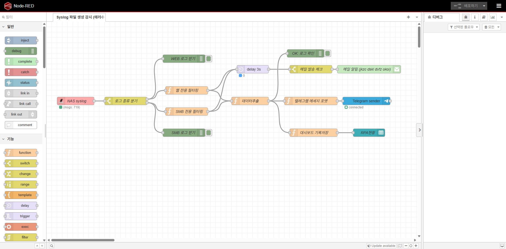
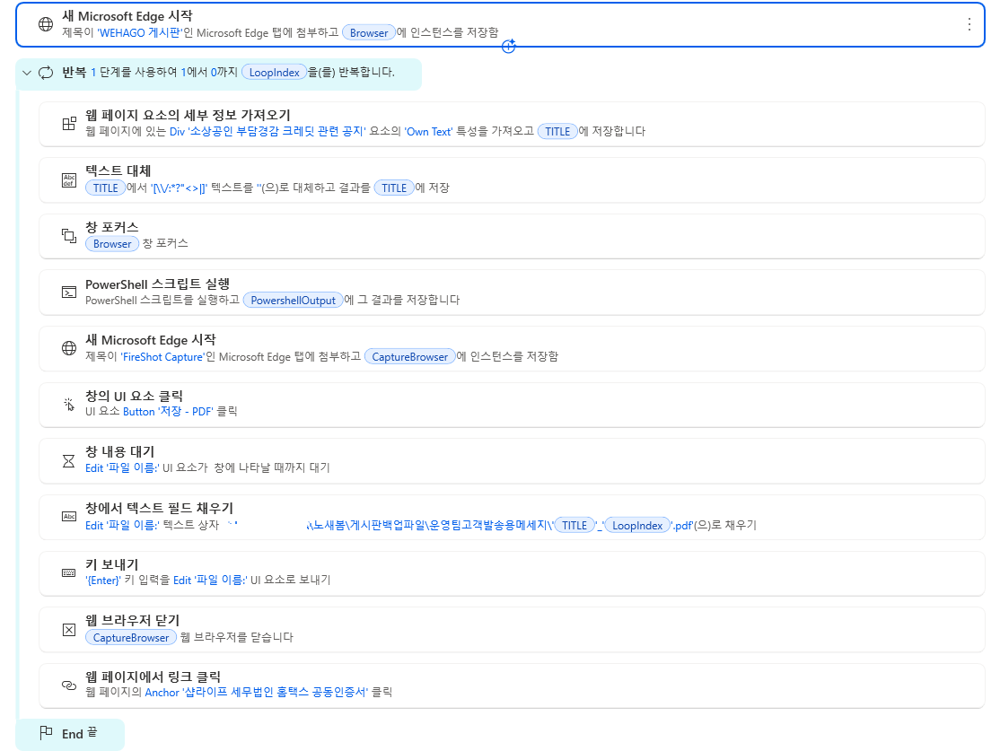
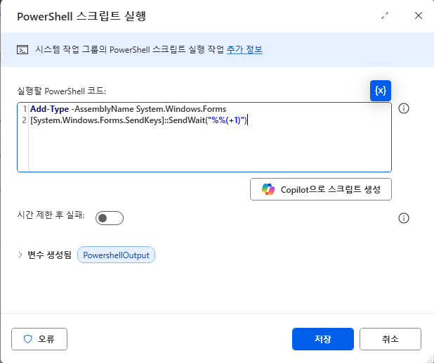
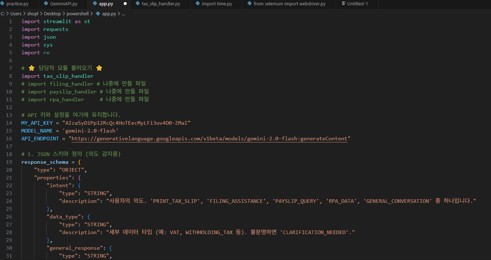
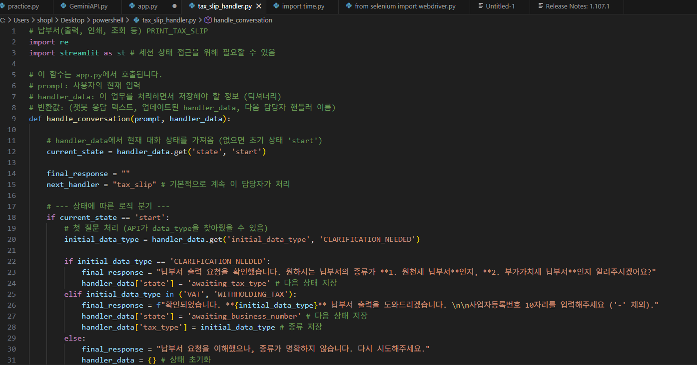

# 🤖 RPA Developer Portfolio
### "비효율을 자동화로 바꾸는 개발자, 노새봄입니다."

 

> 유통/물류 현장의 대량 데이터 운영 경험을 바탕으로 실무의 고충을 해결하는 **RPA 솔루션**을 설계합니다. 개발은 물론, 유지보수까지 다재다능한 인재! 단순 반복 업무를 제거하여 동료들이 더 가치 있는 일에 집중할 수 있도록 돕습니다.

---

## ✨ Featured Project (핵심 역량)

### 🔗 NAS & Node-RED 기반 초자동화 시스템
> **단순 스케줄링을 넘어, 파일 업로드를 실시간으로 감지하는 이벤트 기반(Event-Driven) 자동화 구축**

**Why?** 기존 UI 방식의 속도 저하와 불안정성을 해결, 실시간 수행을 목표로 도입
* **Architecture:** Synology NAS (Docker) ↔ Node-RED ↔ RPA Bot
* **Key Tech:** `Webhook` `REST API` `JSON Parsing` `Serverless`

<b>👀 (Click) 워크플로우 미리보기</b>

> **[Flow Description]**
> NAS 파일 감지 → 데이터 전처리(json) → 메일&텔레그램발송 → RPA 봇 호출(Webhook) → 결과 DB 저장
> 

 

👉 **[NAS 상세 기술서 및 코드 보러 가기 (Click)](./NAS_Workflow.md)**

---

## 💼 Key Projects Experience

### 🧾 세무/회계 완전 자동화 (Tax & Accounting)
급여 대장 작성부터 신고, 납부서 출력까지의 **Unattended(무인)** 자동화
- **🔧 Tech:** `WEHAGO API` `PAD` `Excel`
- **🚀 Impact:**
    - 급여/세무 신고 프로세스 **100% 자동화**
    - 부가세 신고 기간 업무 시간 **약 80% 단축**
    - 대량 데이터 검증 로직으로 **오류율 0% 달성**
 
 

👉 **[원천 상세 기술서 및 코드 보러 가기 (Click)](./Tax_Automation.md)**

---

### 👥 인사/총무 자동화 (HR & GA)
보안이 중요한 급여 명세서 발송 및 4대 보험 신고 업무 처리
- **🔧 Tech:** `Outlook` `PAD` `Security Module`
- **🚀 Impact:**
    - 보안 메일/메신저 개별 발송 봇 개발
    - 취득/상실 신고서 자동 생성으로 수기 업무 제거
    - 직원 봉사단 활동 내역 취합 후 업로드

### 📊 데이터 운영 및 리포팅 (Data Ops)
SAP ERP 및 레거시 시스템 데이터 정합성 검증
- **🔧 Tech:** `SAP ERP` `Web Crawling` `SQL`
- **🚀 Impact:**
    - 매일 전사 물류/재고 데이터 추출 및 정합성 체크 자동화
    - 경쟁사 가격 크롤링을 통한 리포트 자동 생성

---

### 🗨️ 카카오톡 메세지 자동발송 (Data Ops)
카카오 비즈니스 웹페이지를 사용하여 이미지&텍스트 대량전송 자동화
- **🔧 Tech:** `KakaoTalk` `Execl`
- **🚀 Impact:**
    - 엑셀 마스터 파일을 활용해 수신 리스트별 맞춤형 이미지/텍스트 매칭 발송 로직 구현
    - 이메일 OTP 인증 세션을 자동으로 읽어와 로그인 2차 인증 단계까지 완전 자동화 성공
    - 수동 발송 대비 작업 시간을 90% 이상 단축하여 Data Ops 관점의 업무 효율 극대화

---

### 🔄 지능형 재시작 로직 (RestartGubun) 개발
장애 발생 시 중복 작업 방지 및 처리 효율 극대화
- **🔧 핵심기술:** `Checkpoint Recovery` `Data Flagging` `Transaction``Monitoring`
- **🚀 Impact:**
    - 프로세스 중단 시 처음부터 다시 실행하여 발생하는 시간 낭비와 데이터 중복 처리 리스크 발생
    - 각 트랜잭션 완료 시마다 상태값(Status Flag)을 실시간 업데이트하는 RestartGubun 로직 구현
    - 오류 복구 시 불필요한 재작업 제거로 복구 시간 50% 이상 절감
    - 데이터 중복 기입 및 이중 발송 리스크 원천 차단

---

### 📂 웹 게시판 데이터 백업 및 아카이빙 자동화
웹 크롤링과 시스템 단축키 제어를 통한 게시물 전수 조사 및 백업
- **🔧 Tech:** `Web Crawling` `Send Keys (Hotkeys)` `File System Control`
- **🚀 Impact:**
    - 크롤링 기술을 활용해 게시판의 텍스트 및 메타데이터를 구조화된 데이터로 추출
    - PowerShell 및 시스템 캡처 기능을 제어하여 게시물 전체 화면을 이미지로 자동 저장
    - 백업된 데이터를 바탕으로 대상 웹 페이지에 자동 게시 및 복구 프로세스 구현
    -수작업 대비 백업 속도 300% 향상 및 데이터 누락 가능성 원천 차단

<b>👀 (Click) 백업 프로세스 간단확인 </b>

> **[Flow Description]**
> 웹 인스턴스 등록 → SendKey (powershell) → 확장프로그램실행 → RPA파일저장 → 백업
> 
> 
> PowerShell code
> 
> 

---

### 🤖 LLM 기반 맞춤형 질의응답 챗봇 개발
Gemini API를 활용한 지능형 Q&A 챗봇 시스템 구축 및 웹 연동
- **🔧 Tech:** `Gemini API (LLM)` `API Integration` `Prompt Engineering`
- **🚀 Impact:**
    - 사용자 질의를 분석하고 자연어 처리(NLP)를 통해 정확한 맞춤형 답변 자동 생성 및 제공
    - AI 모델 API 연동을 통해 단순 반복 응대 업무를 최소화하고 사용자 편의성 극대화

<b>👀 (Click) 코드 간편 확인 </b>

> **[Flow Description]**
> 
> 
> 

  Copyright © 2026 Saebom No. All rights reserved.

