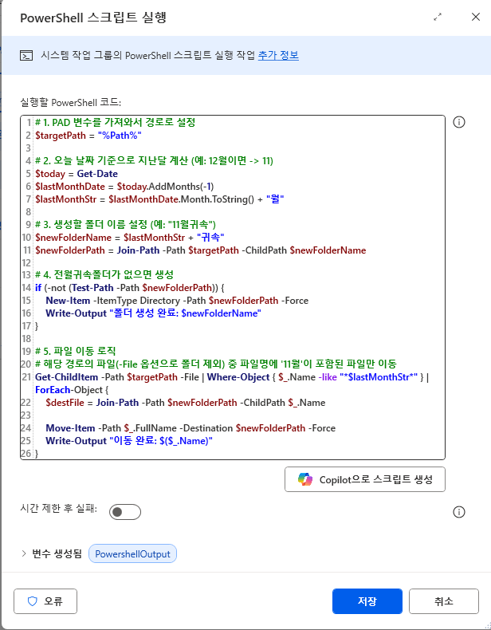
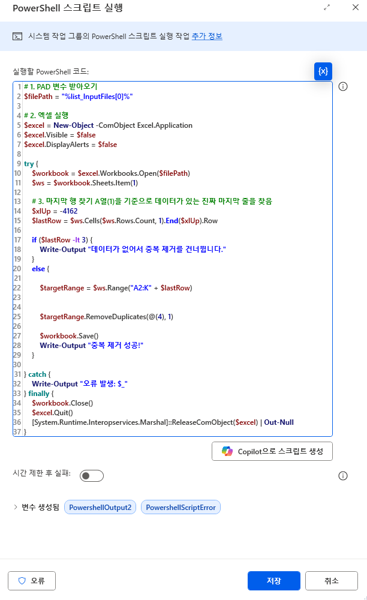

# 🛠️ 업무 효율을 높이는 유틸리티 봇 모음 (Utility Bots & Scripts)
> 거창한 프로젝트는 아니지만, 매일 반복되는 **"3분짜리 귀찮음"**을 해결하기 위해 개발한 소규모 자동화 도구들입니다.

---

## 1. 📂 다운로드 폴더 자동 정리기
흐름 순서  
  
PowerShell code  
   

**"폴더가 더러운 건 못 참아!"**
* **기능:** 매월 백업,log 폴더의 파일을 지정 된 제목양식을 기준으로 날짜별로 자동 분류하여 폴더링
* **Tech:** `PowerShell` `Windows Task Scheduler`

---

## 2. 🗃️ 대용량 엑셀 중복제거 자동화
PowerShell code  
  

**"엑셀기능보다 빠르고 쉬운 중복제거 Good~"**
* **기능:** 엑셀을 여는 시간조차 아깝다 ! 바로바로 중복제거가 필요한 경우 Start!
* **Tech:** `PowerShell`

---

## 3. 📊 엑셀 파일 100개 1초 만에 합치기 (Excel Merger)

**"Ctrl+C, Ctrl+V 하다가 퇴근 시간 놓치지 않게."**
* **기능:** 각 지점/거래처에서 보내온 동일한 양식의 엑셀 파일 수백 개를 하나의 마스터 파일로 병합 및 중복 제거
* **Tech:** `Excel VBA` `PAD`

---

## 4. 📧 특정 첨부파일 자동 저장 (Email Attachment Saver)

**"세금계산서 메일만 골라서 저장해줘."**
* **기능:** 아웃룩(Outlook) 수신 메일 중 제목에 '세금계산서'가 포함된 메일의 PDF 첨부파일만 추출하여 NAS 서버에 자동 저장
* **Tech:** `PAD` `Outlook Automation`
